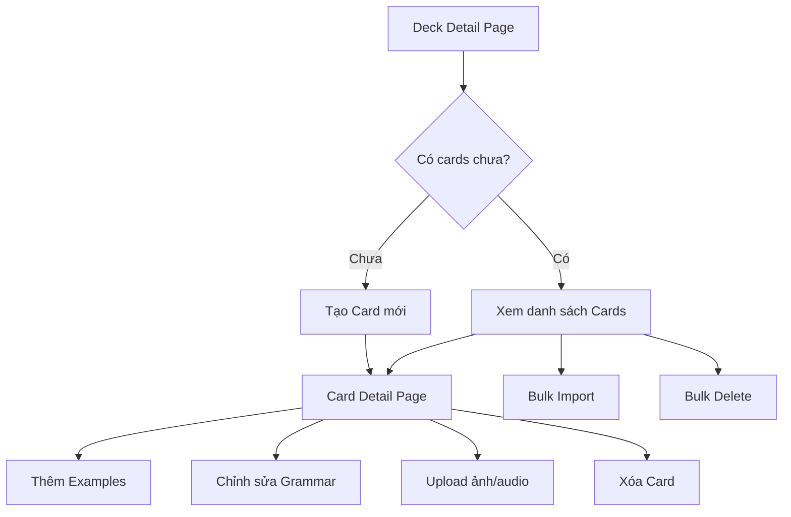

# Sprint 3: Card Management - API Documentation

> **Base URL**: `http://localhost:5000/api`
>
> **Authentication**: Tất cả endpoints trong Sprint này đều yêu cầu 🔒 `Authorization: Bearer <access_token>`

---

## Application Flow Overview



### Luồng sử dụng chính

1. **Từ Deck Detail** → Gọi `GET /decks/{deckId}/cards` để lấy danh sách cards
2. **Tạo Card đơn** → Gọi `POST /decks/{deckId}/cards` để tạo card mới
3. **Bulk Import** → Gọi `POST /decks/{deckId}/cards/bulk` để import nhiều cards cùng lúc
4. **Chi tiết Card** → Gọi `GET /decks/{deckId}/cards/{id}` để xem full info
5. **Chỉnh sửa Card** → Gọi `PUT /decks/{deckId}/cards/{id}` để cập nhật
6. **Thêm Example** → Gọi `POST /cards/{cardId}/examples`
7. **Cập nhật Grammar** → Gọi `PUT /cards/{cardId}/grammar`
8. **Xóa Card đơn** → Gọi `DELETE /decks/{deckId}/cards/{id}`
9. **Bulk Delete** → Gọi `DELETE /decks/{deckId}/cards/bulk` để xóa nhiều cards

---

## Table of Contents

1. [Schemas](#schemas)
2. [Card CRUD](#card-crud)
3. [Bulk Operations](#bulk-operations)
4. [Card Examples](#card-examples)
5. [Grammar Details](#grammar-details)
6. [Media APIs](#media-apis)

---

## Schemas

### CardSummaryDTO

Dùng trong danh sách cards - thông tin tóm tắt.

| Field               | Type      | Description                     |
| ------------------- | --------- | ------------------------------- |
| `id`                | `number`  | ID của card                     |
| `type`              | `string`  | `"Vocabulary"` hoặc `"Grammar"` |
| `term`              | `string`  | Từ/cấu trúc ngữ pháp            |
| `meaning`           | `string`  | Nghĩa                           |
| `imageMediaId`      | `number?` | ID của ảnh đính kèm             |
| `imageUrl`          | `string?` | URL của ảnh                     |
| `hasExamples`       | `boolean` | Có ví dụ hay không              |
| `hasGrammarDetails` | `boolean` | Có chi tiết ngữ pháp hay không  |

### CardDetailDTO

Dùng khi xem chi tiết card - thông tin đầy đủ.

| Field            | Type                 | Description                     |
| ---------------- | -------------------- | ------------------------------- |
| `id`             | `number`             | ID của card                     |
| `deckId`         | `number`             | ID của deck chứa card           |
| `type`           | `string`             | `"Vocabulary"` hoặc `"Grammar"` |
| `term`           | `string`             | Từ/cấu trúc ngữ pháp            |
| `meaning`        | `string`             | Nghĩa                           |
| `synonyms`       | `string?`            | Từ đồng nghĩa                   |
| `imageMediaId`   | `number?`            | ID của ảnh đính kèm             |
| `imageUrl`       | `string?`            | URL của ảnh                     |
| `note`           | `string?`            | Ghi chú                         |
| `grammarDetails` | `GrammarDetailsDTO?` | Chi tiết ngữ pháp               |
| `examples`       | `CardExampleDTO[]`   | Danh sách ví dụ                 |

### CardExampleDTO

| Field                | Type      | Description                       |
| -------------------- | --------- | --------------------------------- |
| `id`                 | `number`  | ID của example                    |
| `sentenceJapanese`   | `string`  | Câu tiếng Nhật                    |
| `sentenceMeaning`    | `string`  | Nghĩa của câu                     |
| `clozePart`          | `string?` | Phần bị ẩn (để điền vào)          |
| `alternativeAnswers` | `string?` | Các đáp án thay thế (phân cách ,) |
| `audioMediaId`       | `number?` | ID của audio                      |
| `audioUrl`           | `string?` | URL của audio                     |

### GrammarDetailsDTO

| Field            | Type      | Description                                    |
| ---------------- | --------- | ---------------------------------------------- |
| `structure`      | `string?` | Cấu trúc ngữ pháp                              |
| `explanation`    | `string?` | Giải thích chi tiết                            |
| `caution`        | `string?` | Lưu ý khi sử dụng                              |
| `level`          | `string`  | Level JLPT (N5, N4, N3, N2, N1)                |
| `formationRules` | `string?` | **[NEW]** Chi tiết cách chia động từ/tính từ   |
| `nuance`         | `string?` | **[NEW]** Sắc thái nghĩa                       |
| `usageNotes`     | `string?` | **[NEW]** Ghi chú cách dùng chi tiết           |
| `register`       | `string?` | **[NEW]** Formal / Informal / Written / Spoken |

---

## Card CRUD

### 1. Get Cards List

> **Khi nào dùng**: Hiển thị danh sách cards trong một deck

```
GET /decks/{deckId}/cards
```

#### Path Parameters

| Param    | Type     | Description |
| -------- | -------- | ----------- |
| `deckId` | `number` | Deck ID     |

#### Query Parameters

| Param      | Type     | Required | Default | Description                             |
| ---------- | -------- | -------- | ------- | --------------------------------------- |
| `page`     | `number` | ❌       | 1       | Số trang                                |
| `pageSize` | `number` | ❌       | 20      | Số items mỗi trang                      |
| `keyword`  | `string` | ❌       | -       | Tìm theo term hoặc meaning              |
| `type`     | `string` | ❌       | -       | Filter: `"Vocabulary"` hoặc `"Grammar"` |

#### Response

```json
{
  "code": 200,
  "success": true,
  "data": [
    {
      "id": 1,
      "type": "Vocabulary",
      "term": "食べる",
      "meaning": "Ăn",
      "imageMediaId": 123,
      "imageUrl": "https://storage.example.com/images/123.jpg",
      "hasExamples": true,
      "hasGrammarDetails": false
    }
  ],
  "metaData": {
    "page": 1,
    "pageSize": 20,
    "total": 150,
    "totalPage": 8
  }
}
```

#### Errors

| Message              | Khi nào            |
| -------------------- | ------------------ |
| `Deck_Not_Found_404` | Deck không tồn tại |

---

### 2. Get Card Detail

> **Khi nào dùng**: Xem chi tiết đầy đủ của một card (bao gồm examples và grammar)

```
GET /decks/{deckId}/cards/{id}
```

#### Path Parameters

| Param    | Type     | Description |
| -------- | -------- | ----------- |
| `deckId` | `number` | Deck ID     |
| `id`     | `number` | Card ID     |

#### Response

```json
{
  "code": 200,
  "success": true,
  "data": {
    "id": 1,
    "deckId": 5,
    "type": "Vocabulary",
    "term": "食べる",
    "meaning": "Ăn",
    "synonyms": "召し上がる",
    "imageMediaId": 123,
    "imageUrl": "https://storage.example.com/images/123.jpg",
    "note": "Động từ nhóm 2",
    "grammarDetails": null,
    "examples": [
      {
        "id": 1,
        "sentenceJapanese": "私はりんごを食べる",
        "sentenceMeaning": "Tôi ăn táo",
        "clozePart": "食べる",
        "alternativeAnswers": null,
        "audioMediaId": 456,
        "audioUrl": "https://storage.example.com/audio/456.mp3"
      }
    ]
  }
}
```

#### Errors

| Message              | Khi nào            |
| -------------------- | ------------------ |
| `Card_Not_Found_404` | Card không tồn tại |

---

### 3. Create Card

> **Khi nào dùng**: Tạo card mới trong một deck

```
POST /decks/{deckId}/cards
```

#### Path Parameters

| Param    | Type     | Description |
| -------- | -------- | ----------- |
| `deckId` | `number` | Deck ID     |

#### Request Body

```json
{
  "type": "Vocabulary",
  "term": "食べる",
  "meaning": "Ăn",
  "synonyms": "召し上がる",
  "imageMediaId": 123,
  "note": "Động từ nhóm 2",
  "grammarDetails": null,
  "examples": [
    {
      "sentenceJapanese": "私はりんごを食べる",
      "sentenceMeaning": "Tôi ăn táo",
      "clozePart": "食べる",
      "alternativeAnswers": null,
      "audioMediaId": null
    }
  ]
}
```

| Field            | Type                    | Required | Description                      |
| ---------------- | ----------------------- | -------- | -------------------------------- |
| `type`           | `string`                | ❌       | Default: `"Vocabulary"`          |
| `term`           | `string`                | ✅       | Từ vựng/cấu trúc                 |
| `meaning`        | `string`                | ✅       | Nghĩa                            |
| `synonyms`       | `string`                | ❌       | Từ đồng nghĩa                    |
| `imageMediaId`   | `number`                | ❌       | ID ảnh (từ Media API)            |
| `note`           | `string`                | ❌       | Ghi chú                          |
| `grammarDetails` | `GrammarDetailsRequest` | ❌       | Chi tiết ngữ pháp (xem bên dưới) |
| `examples`       | `CardExampleRequest[]`  | ❌       | Danh sách ví dụ                  |

##### GrammarDetailsRequest

| Field            | Type     | Required | Description                              |
| ---------------- | -------- | -------- | ---------------------------------------- |
| `structure`      | `string` | ❌       | Cấu trúc ngữ pháp                        |
| `explanation`    | `string` | ❌       | Giải thích chi tiết                      |
| `caution`        | `string` | ❌       | Lưu ý                                    |
| `level`          | `string` | ❌       | Default: `"N5"`                          |
| `formationRules` | `string` | ❌       | **[NEW]** Chi tiết cách chia động từ/adj |
| `nuance`         | `string` | ❌       | **[NEW]** Sắc thái nghĩa                 |
| `usageNotes`     | `string` | ❌       | **[NEW]** Ghi chú cách dùng              |
| `register`       | `string` | ❌       | **[NEW]** Formal/Informal/Written/Spoken |

##### CardExampleRequest

| Field                | Type     | Required | Description             |
| -------------------- | -------- | -------- | ----------------------- |
| `sentenceJapanese`   | `string` | ✅       | Câu tiếng Nhật          |
| `sentenceMeaning`    | `string` | ✅       | Nghĩa                   |
| `clozePart`          | `string` | ❌       | Phần điền vào           |
| `alternativeAnswers` | `string` | ❌       | Đáp án thay thế         |
| `audioMediaId`       | `number` | ❌       | ID audio (từ Media API) |

#### Response

Trả về `CardDetailDTO` của card vừa tạo.

#### Errors

| Message              | Khi nào            |
| -------------------- | ------------------ |
| `Deck_Not_Found_404` | Deck không tồn tại |

---

### 4. Update Card

> **Khi nào dùng**: Chỉnh sửa thông tin cơ bản của card

```
PUT /decks/{deckId}/cards/{id}
```

#### Path Parameters

| Param    | Type     | Description |
| -------- | -------- | ----------- |
| `deckId` | `number` | Deck ID     |
| `id`     | `number` | Card ID     |

#### Request Body

```json
{
  "type": "Vocabulary",
  "term": "食べる (updated)",
  "meaning": "Ăn, dùng bữa",
  "synonyms": "召し上がる, いただく",
  "imageMediaId": 124,
  "note": "Động từ nhóm 2 - cập nhật"
}
```

| Field          | Type     | Required | Description      |
| -------------- | -------- | -------- | ---------------- |
| `type`         | `string` | ❌       | Loại card        |
| `term`         | `string` | ❌       | Từ vựng/cấu trúc |
| `meaning`      | `string` | ❌       | Nghĩa            |
| `synonyms`     | `string` | ❌       | Từ đồng nghĩa    |
| `imageMediaId` | `number` | ❌       | ID ảnh           |
| `note`         | `string` | ❌       | Ghi chú          |

> [!NOTE]
> Chỉ gửi các field cần cập nhật, các field không gửi sẽ giữ nguyên giá trị cũ.

#### Response

Trả về `CardDetailDTO` đã cập nhật.

#### Errors

| Message              | Khi nào            |
| -------------------- | ------------------ |
| `Card_Not_Found_404` | Card không tồn tại |

---

### 5. Delete Card

> **Khi nào dùng**: Xóa một card

```
DELETE /decks/{deckId}/cards/{id}
```

#### Path Parameters

| Param    | Type     | Description |
| -------- | -------- | ----------- |
| `deckId` | `number` | Deck ID     |
| `id`     | `number` | Card ID     |

#### Response

```json
{
  "code": 200,
  "success": true,
  "data": true
}
```

#### Errors

| Message              | Khi nào            |
| -------------------- | ------------------ |
| `Card_Not_Found_404` | Card không tồn tại |

---

## Bulk Operations

### 6. Bulk Create Cards

> **Khi nào dùng**: Import nhiều cards cùng lúc (từ CSV, Excel, etc.)

```
POST /decks/{deckId}/cards/bulk
```

#### Path Parameters

| Param    | Type     | Description |
| -------- | -------- | ----------- |
| `deckId` | `number` | Deck ID     |

#### Request Body

```json
{
  "cards": [
    {
      "term": "食べる",
      "meaning": "Ăn",
      "type": "Vocabulary"
    },
    {
      "term": "飲む",
      "meaning": "Uống",
      "type": "Vocabulary"
    }
  ]
}
```

#### Response

```json
{
  "code": 200,
  "success": true,
  "data": {
    "totalRequested": 2,
    "totalCreated": 2,
    "createdCards": [...],
    "errors": null
  }
}
```

| Field            | Type                    | Description                  |
| ---------------- | ----------------------- | ---------------------------- |
| `totalRequested` | `number`                | Số cards yêu cầu tạo         |
| `totalCreated`   | `number`                | Số cards tạo thành công      |
| `createdCards`   | `CardDetailDTO[]`       | Danh sách cards đã tạo       |
| `errors`         | `BulkOperationError[]?` | Lỗi nếu có (index + message) |

### Notes

- Nếu một số cards thất bại, API vẫn trả về 200 và tạo các cards thành công
- Kiểm tra `errors` để biết cards nào thất bại

---

### 7. Bulk Update Cards

> **Khi nào dùng**: Cập nhật nhiều cards cùng lúc

```
PUT /decks/{deckId}/cards/bulk
```

#### Request Body

```json
{
  "cards": [
    {
      "id": 1,
      "term": "食べる (updated)",
      "meaning": "Ăn, dùng bữa"
    },
    {
      "id": 2,
      "meaning": "Uống nước"
    }
  ]
}
```

#### Response

```json
{
  "code": 200,
  "success": true,
  "data": {
    "totalRequested": 2,
    "totalUpdated": 2,
    "updatedCards": [...],
    "errors": null
  }
}
```

---

### 8. Bulk Delete Cards

> **Khi nào dùng**: Xóa nhiều cards đã chọn

```
DELETE /decks/{deckId}/cards/bulk
```

#### Request Body

```json
{
  "cardIds": [1, 2, 3, 4, 5]
}
```

#### Response

```json
{
  "code": 200,
  "success": true,
  "data": {
    "totalRequested": 5,
    "totalDeleted": 5,
    "deletedIds": [1, 2, 3, 4, 5],
    "failedIds": null
  }
}
```

### Notes

- Hiển thị confirmation dialog với số lượng cards sẽ bị xóa
- Cho phép user chọn nhiều cards bằng checkbox

---

## Card Examples

### 9. Add Example

> **Khi nào dùng**: Thêm câu ví dụ vào card

```
POST /cards/{cardId}/examples
```

#### Path Parameters

| Param    | Type     | Description |
| -------- | -------- | ----------- |
| `cardId` | `number` | Card ID     |

#### Request Body

```json
{
  "sentenceJapanese": "毎朝ご飯を食べる",
  "sentenceMeaning": "Mỗi sáng ăn cơm",
  "clozePart": "食べる",
  "alternativeAnswers": "食べます",
  "audioMediaId": null
}
```

| Field                | Type     | Required | Description           |
| -------------------- | -------- | -------- | --------------------- |
| `sentenceJapanese`   | `string` | ✅       | Câu tiếng Nhật        |
| `sentenceMeaning`    | `string` | ✅       | Nghĩa                 |
| `clozePart`          | `string` | ❌       | Phần điền vào (cloze) |
| `alternativeAnswers` | `string` | ❌       | Đáp án thay thế       |
| `audioMediaId`       | `number` | ❌       | ID audio              |

#### Response

Trả về `CardExampleDTO` của example vừa tạo.

---

### 10. Update Example

> **Khi nào dùng**: Chỉnh sửa câu ví dụ

```
PUT /cards/{cardId}/examples/{id}
```

#### Path Parameters

| Param    | Type     | Description |
| -------- | -------- | ----------- |
| `cardId` | `number` | Card ID     |
| `id`     | `number` | Example ID  |

#### Request Body

Tương tự Add Example, nhưng tất cả fields đều optional.

#### Response

Trả về `CardExampleDTO` đã cập nhật.

---

### 11. Delete Example

> **Khi nào dùng**: Xóa câu ví dụ

```
DELETE /cards/{cardId}/examples/{id}
```

#### Response

```json
{
  "code": 200,
  "success": true,
  "data": true
}
```

---

## Grammar Details

### 12. Update Grammar Details

> **Khi nào dùng**: Thêm/cập nhật thông tin ngữ pháp cho card (chỉ áp dụng cho Grammar cards)

```
PUT /cards/{cardId}/grammar
```

#### Path Parameters

| Param    | Type     | Description |
| -------- | -------- | ----------- |
| `cardId` | `number` | Card ID     |

#### Request Body

```json
{
  "structure": "Vる + ことができる",
  "explanation": "Diễn tả khả năng làm việc gì đó",
  "caution": "Không dùng với động từ khả năng",
  "level": "N4",
  "formationRules": "Group 1: う → える + ことができる\nGroup 2: る → られる + ことができる\n(または Vる + ことができる)",
  "nuance": "Nhấn mạnh khả năng làm được, mang tính khách quan",
  "usageNotes": "Thường dùng để nói về khả năng đã học được, không phải khả năng bẩm sinh. Có thể thay thế bằng potential form cho ngắn gọn hơn.",
  "register": "Neutral"
}
```

| Field            | Type     | Required | Description                              |
| ---------------- | -------- | -------- | ---------------------------------------- |
| `structure`      | `string` | ❌       | Cấu trúc                                 |
| `explanation`    | `string` | ❌       | Giải thích                               |
| `caution`        | `string` | ❌       | Lưu ý                                    |
| `level`          | `string` | ❌       | JLPT Level                               |
| `formationRules` | `string` | ❌       | **[NEW]** Chi tiết cách chia động từ/adj |
| `nuance`         | `string` | ❌       | **[NEW]** Sắc thái nghĩa                 |
| `usageNotes`     | `string` | ❌       | **[NEW]** Ghi chú cách dùng chi tiết     |
| `register`       | `string` | ❌       | **[NEW]** Formal/Informal/Written/Spoken |

#### Response

Trả về `GrammarDetailsDTO` đã cập nhật.

### Notes

- API này sẽ tạo mới nếu chưa có, hoặc cập nhật nếu đã tồn tại
- Chủ yếu dùng cho cards có `type: "Grammar"`
- **formationRules**: Có thể chứa nhiều dòng với `\n` để mô tả cách chia cho từng nhóm động từ
- **register**: Các giá trị hay dùng: `"Formal"`, `"Informal"`, `"Written"`, `"Spoken"`, `"Neutral"`, `"Polite"`

---

## Media APIs

### 13. Upload Image

> **Khi nào dùng**: Upload ảnh minh họa cho card

```
POST /media/image
```

#### Request (multipart/form-data)

| Field  | Type   | Required | Description |
| ------ | ------ | -------- | ----------- |
| `file` | `File` | ✅       | File ảnh    |

#### Response

```json
{
  "code": 200,
  "success": true,
  "data": {
    "id": 123,
    "url": "https://storage.example.com/images/123.jpg",
    "type": "Image"
  }
}
```

### Notes

- Lưu lại `id` để gán vào `imageMediaId` khi tạo/update card

---

### 14. Upload Audio

> **Khi nào dùng**: Upload audio cho example

```
POST /media/audio
```

#### Request (multipart/form-data)

| Field  | Type   | Required | Description |
| ------ | ------ | -------- | ----------- |
| `file` | `File` | ✅       | File audio  |

#### Response

```json
{
  "code": 200,
  "success": true,
  "data": {
    "id": 456,
    "url": "https://storage.example.com/audio/456.mp3",
    "type": "Audio"
  }
}
```

### Notes

- Lưu lại `id` để gán vào `audioMediaId` khi tạo/update example

---

### 15. Delete Media

> **Khi nào dùng**: Xóa file media không còn sử dụng

```
DELETE /media/{id}
```

#### Path Parameters

| Param | Type     | Description |
| ----- | -------- | ----------- |
| `id`  | `number` | Media ID    |

#### Response

```json
{
  "code": 200,
  "success": true,
  "data": true
}
```

---

## UI Components Checklist

- [ ] **CardsListPage** - Danh sách cards với search & filter
- [ ] **CardRow/CardItem** - Hiển thị tóm tắt card trong list
- [ ] **CardDetailPage** - Xem chi tiết card
- [ ] **CreateCardModal/Page** - Form tạo card mới
- [ ] **EditCardModal/Page** - Form chỉnh sửa card
- [ ] **ExampleForm** - Form thêm/sửa example
- [ ] **GrammarForm** - Form thêm/sửa grammar details
- [ ] **BulkImportModal** - Modal import nhiều cards
- [ ] **BulkActionsBar** - Thanh action khi chọn nhiều cards
- [ ] **ImageUploader** - Component upload ảnh
- [ ] **AudioUploader** - Component upload audio
- [ ] **AudioPlayer** - Component play audio trong example

---

## Error Messages Reference

| Message                      | Description                 |
| ---------------------------- | --------------------------- |
| `Card_Not_Found_404`         | Card không tồn tại          |
| `Card_Permission_Denied_403` | Không có quyền thao tác     |
| `Example_Not_Found_404`      | Example không tồn tại       |
| `Media_Not_Found_404`        | Media file không tồn tại    |
| `Media_Invalid_Type_400`     | Loại file không được hỗ trợ |
