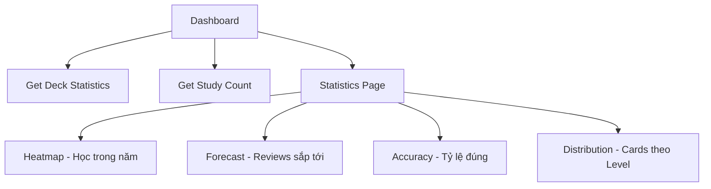

# Sprint 5: Statistics & Dashboard - API Documentation

> **Base URL**: `http://localhost:5000/api`
>
> **Authentication**: Tất cả endpoints trong Sprint này đều yêu cầu 🔒 `Authorization: Bearer <access_token>`

---

## Application Flow Overview



### Luồng sử dụng chính

1. **Dashboard** → Gọi `GET /decks/statistics` + `GET /srs/count` để hiển thị overview
2. **Statistics Page** → Gọi các APIs thống kê chi tiết:
   - `GET /srs/stats/heatmap` - Heatmap số cards đã học theo ngày
   - `GET /srs/stats/forecast` - Dự báo số cards cần ôn trong tuần
   - `GET /srs/stats/accuracy` - Tỷ lệ đúng theo period
   - `GET /srs/stats/distribution` - Phân bố cards theo SRS level

---

## Table of Contents

1. [Schemas](#schemas)
2. [Statistics APIs](#statistics-apis)

---

## Schemas

```typescript
// Một ô trong heatmap (1 ngày)
interface HeatmapDataDTO {
  date: string; // "2024-12-30"
  count: number; // Số reviews trong ngày
}

// Dự báo reviews sắp tới
interface ForecastDTO {
  date: string; // "2024-12-31"
  count: number; // Số cards đến hạn
}

// Thống kê độ chính xác
interface AccuracyDTO {
  correct: number; // Số câu đúng
  incorrect: number; // Số câu sai
  total: number; // Tổng số reviews
  rate: number; // Tỷ lệ đúng (0-100%)
}

// Phân bố cards theo SRS level
interface LevelDistributionDTO {
  distribution: Record<number, number>; // { 0: 15, 1: 20, 2: 35, ... }
  totalCards: number; // Tổng số cards
  learnedCards: number; // Cards đã học (level >= 1)
  burnedCards: number; // Cards đã thuộc (level >= 9)
}
```

---

## Statistics APIs

### 1. Get Heatmap Data

> **Khi nào dùng**: Hiển thị heatmap số reviews theo ngày trong năm (như GitHub contribution graph)

```
GET /srs/stats/heatmap
```

#### Query Parameters

```typescript
interface GetHeatmapRequest {
  year?: number; // Default: năm hiện tại
}
```

#### Response

```json
{
  "code": 200,
  "success": true,
  "data": [
    { "date": "2024-01-01", "count": 25 },
    { "date": "2024-01-02", "count": 30 },
    { "date": "2024-01-03", "count": 0 },
    ...
  ]
}
```

### Notes

- Trả về 365/366 ngày trong năm
- Màu sắc ô phụ thuộc vào `count` (0 = xám, cao = xanh đậm)
- Dùng để động viên user duy trì streak học tập

---

### 2. Get Forecast

> **Khi nào dùng**: Hiển thị số reviews dự kiến trong N ngày tới

```
GET /srs/stats/forecast
```

#### Query Parameters

```typescript
interface GetForecastRequest {
  days?: number; // Default: 7 (một tuần)
}
```

#### Response

```json
{
  "code": 200,
  "success": true,
  "data": [
    { "date": "2024-12-31", "count": 45 },
    { "date": "2025-01-01", "count": 32 },
    { "date": "2025-01-02", "count": 28 },
    ...
  ]
}
```

### Notes

- Giúp user lên kế hoạch học tập
- Có thể hiển thị dưới dạng bar chart

---

### 3. Get Accuracy Stats

> **Khi nào dùng**: Hiển thị tỷ lệ đúng/sai theo khoảng thời gian

```
GET /srs/stats/accuracy
```

#### Query Parameters

```typescript
interface GetAccuracyRequest {
  period?: "day" | "week" | "month" | "all"; // Default: "week"
}
```

#### Response

```json
{
  "code": 200,
  "success": true,
  "data": {
    "correct": 180,
    "incorrect": 45,
    "total": 225,
    "rate": 80.0
  }
}
```

### Notes

- Hiển thị dạng pie chart hoặc progress ring
- Có thể filter theo period để xem trend

---

### 4. Get Level Distribution

> **Khi nào dùng**: Hiển thị phân bố cards theo SRS level (bao nhiêu Apprentice, Guru, Master, etc.)

```
GET /srs/stats/distribution
```

#### Query Parameters

```typescript
interface GetDistributionRequest {
  deckId?: number; // null = tất cả decks
}
```

#### Response

```json
{
  "code": 200,
  "success": true,
  "data": {
    "distribution": {
      "0": 50, // New
      "1": 30, // Apprentice 1
      "2": 25, // Apprentice 2
      "3": 40, // Apprentice 3
      "4": 35, // Apprentice 4
      "5": 60, // Guru 1
      "6": 45, // Guru 2
      "7": 80, // Master
      "8": 100, // Enlightened
      "9": 150 // Burned
    },
    "totalCards": 615,
    "learnedCards": 565,
    "burnedCards": 150
  }
}
```

### Notes

- Hiển thị dạng stacked bar chart hoặc pie chart
- Giúp user biết được progress tổng thể
- `burnedCards` là cards đã thuộc hoàn toàn (không cần ôn nữa)

---

## UI Components Checklist

- [ ] **HeatmapChart** - GitHub-style contribution heatmap
- [ ] **ForecastChart** - Bar chart dự báo reviews
- [ ] **AccuracyRing** - Progress ring tỷ lệ đúng
- [ ] **LevelDistributionChart** - Stacked bar/pie chart phân bố level
- [ ] **StatsOverviewCard** - Card tổng quan cho Dashboard
- [ ] **PeriodSelector** - Dropdown chọn period (day/week/month)

---

## Error Messages Reference

| Message             | Description              |
| ------------------- | ------------------------ |
| `Stats_No_Data_404` | Chưa có dữ liệu thống kê |
