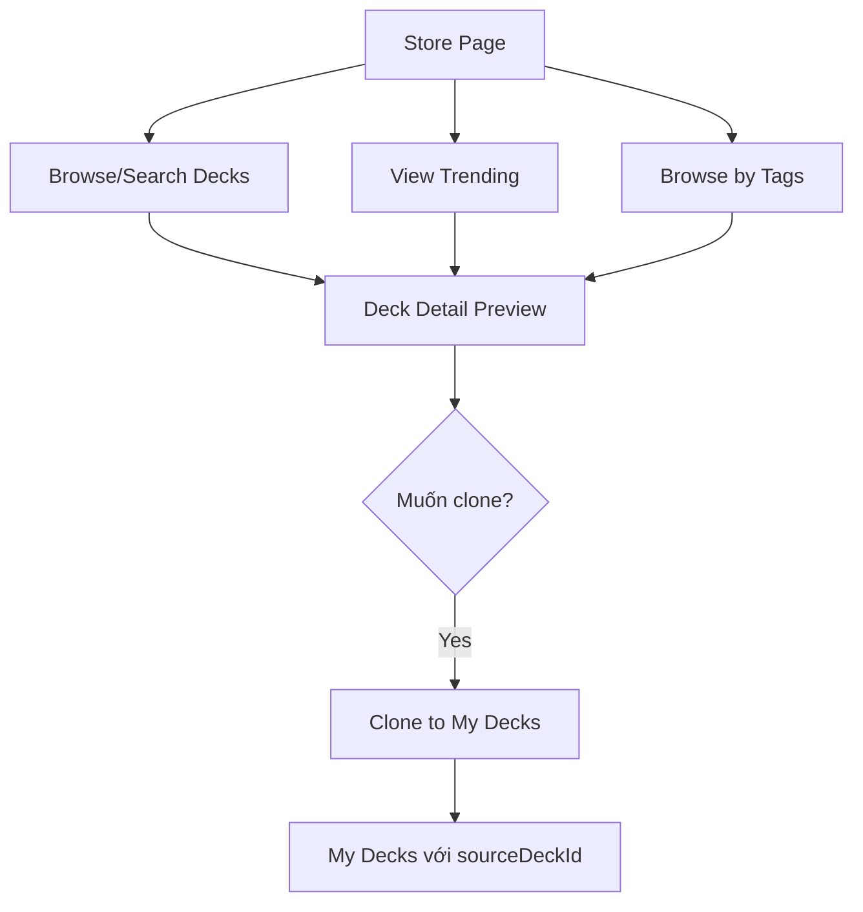

# Sprint 6: Community Store - API Documentation

> **Base URL**: `http://localhost:5000/api`
>
> **Authentication**: Các endpoints đánh dấu 🔒 yêu cầu `Authorization: Bearer <access_token>`

---

## Application Flow Overview



### Luồng sử dụng chính

1. **Store Page** → Gọi `GET /store/decks` để browse public decks
2. **Trending** → Gọi `GET /store/decks/trending` để xem decks phổ biến
3. **Tags Cloud** → Gọi `GET /store/tags/popular` để lấy tags phổ biến
4. **Xem Preview** → Gọi `GET /store/decks/{id}` để xem chi tiết deck trước khi clone
5. **Clone** → Gọi `POST /store/decks/{id}/clone` để clone deck về thư viện cá nhân

---

## Table of Contents

1. [Schemas](#schemas)
2. [Store APIs](#store-apis)

---

## Schemas

```typescript
// Thông tin deck public trong Store
interface PublicDeckDetailDTO {
  id: number;
  name: string;
  description: string | null;
  type: "Vocabulary" | "Grammar";
  author: AuthorDTO;
  tags: string[];
  totalCards: number;
  downloads: number; // Số lần được clone
  createdAt: string;
}

interface AuthorDTO {
  id: number;
  name: string;
  avatarUrl: string | null;
}

// Thống kê tag
interface TagStatDTO {
  name: string; // Tên tag
  count: number; // Số decks có tag này
}

// Request search
interface SearchDeckRequest {
  page?: number; // Default: 1
  pageSize?: number; // Default: 20
  keyword?: string; // Tìm theo tên/mô tả
  type?: "Vocabulary" | "Grammar";
  tags?: string[]; // Filter theo tags
}

// Request clone
interface CloneDeckRequest {
  customName?: string; // Tên tùy chỉnh, null = giữ tên gốc
}
```

---

## Store APIs

### 1. Search/Browse Public Decks

> **Khi nào dùng**: Trang Store - browse và tìm kiếm decks công khai

```
GET /store/decks
```

#### Query Parameters

```typescript
interface SearchDeckRequest {
  page?: number; // Default: 1
  pageSize?: number; // Default: 20
  keyword?: string; // Tìm theo tên deck
  type?: string; // "Vocabulary" hoặc "Grammar"
  tags?: string[]; // Filter theo tags (có thể nhiều)
}
```

#### Example Request

```
GET /store/decks?keyword=JLPT&type=Vocabulary&tags=N5&tags=beginner&page=1
```

#### Response

```json
{
  "code": 200,
  "success": true,
  "data": [
    {
      "id": 101,
      "name": "JLPT N5 Complete",
      "description": "800+ từ vựng JLPT N5",
      "type": "Vocabulary",
      "author": {
        "id": 5,
        "name": "sensei_tanaka",
        "avatarUrl": "https://storage.example.com/avatars/5.jpg"
      },
      "tags": ["JLPT", "N5", "beginner"],
      "totalCards": 800,
      "downloads": 1250,
      "createdAt": "2024-06-15T08:00:00Z"
    }
  ],
  "metaData": {
    "page": 1,
    "pageSize": 20,
    "total": 45,
    "totalPage": 3
  }
}
```

### Notes

- Sort mặc định theo `downloads` (phổ biến nhất)
- Có thể filter theo nhiều tags cùng lúc

---

### 2. Get Trending Decks

> **Khi nào dùng**: Hiển thị decks đang hot trên trang chủ Store

```
GET /store/decks/trending
```

#### Query Parameters

```typescript
{
  limit?: number;  // Default: 10
}
```

#### Response

Trả về array `PublicDeckDetailDTO[]` sắp xếp theo lượt download gần đây.

```json
{
  "code": 200,
  "success": true,
  "data": [
    {
      "id": 101,
      "name": "JLPT N5 Complete",
      "downloads": 1250,
      ...
    },
    {
      "id": 203,
      "name": "Kanji N3 Practice",
      "downloads": 980,
      ...
    }
  ]
}
```

### Notes

- Trending dựa trên lượt clone trong 7 ngày gần nhất
- Dùng để hiển thị carousel hoặc featured section

---

### 3. Get Popular Tags

> **Khi nào dùng**: Hiển thị tag cloud hoặc filter options

```
GET /store/tags/popular
```

#### Query Parameters

```typescript
{
  limit?: number;  // Default: 20
}
```

#### Response

```json
{
  "code": 200,
  "success": true,
  "data": [
    { "name": "JLPT", "count": 150 },
    { "name": "N5", "count": 85 },
    { "name": "N4", "count": 72 },
    { "name": "Kanji", "count": 68 },
    { "name": "Grammar", "count": 55 },
    { "name": "beginner", "count": 45 }
  ]
}
```

### Notes

- Sắp xếp theo `count` giảm dần
- Hiển thị dạng tag cloud (size theo count) hoặc chip list

---

### 4. Get Public Deck Detail

> **Khi nào dùng**: Xem preview deck trước khi clone

```
GET /store/decks/{id}
```

#### Path Parameters

| Param | Type     | Description    |
| ----- | -------- | -------------- |
| `id`  | `number` | Public Deck ID |

#### Response

```json
{
  "code": 200,
  "success": true,
  "data": {
    "id": 101,
    "name": "JLPT N5 Complete",
    "description": "Bộ từ vựng đầy đủ cho JLPT N5...",
    "type": "Vocabulary",
    "author": {
      "id": 5,
      "name": "sensei_tanaka",
      "avatarUrl": "https://storage.example.com/avatars/5.jpg"
    },
    "tags": ["JLPT", "N5", "beginner"],
    "totalCards": 800,
    "downloads": 1250,
    "createdAt": "2024-06-15T08:00:00Z"
  }
}
```

#### Errors

| Message                    | Khi nào                                  |
| -------------------------- | ---------------------------------------- |
| `Store_Deck_Not_Found_404` | Deck không tồn tại hoặc không còn public |

### Notes

- Hiển thị preview với thông tin đầy đủ
- Có thể show sample cards (nếu API hỗ trợ)
- Hiển thị nút "Clone to My Decks"

---

### 5. Clone Deck 🔒

> **Khi nào dùng**: Clone deck từ Store về thư viện cá nhân

```
POST /store/decks/{id}/clone
```

#### Path Parameters

| Param | Type     | Description    |
| ----- | -------- | -------------- |
| `id`  | `number` | Public Deck ID |

#### Request Body

```typescript
interface CloneDeckRequest {
  customName?: string; // null = giữ tên gốc
}
```

```json
{
  "customName": "My JLPT N5 study"
}
```

#### Response

Trả về `DeckDetailDTO` của deck mới được clone.

```json
{
  "code": 200,
  "success": true,
  "data": {
    "id": 15,
    "name": "My JLPT N5 study",
    "description": "Bộ từ vựng đầy đủ cho JLPT N5...",
    "type": "Vocabulary",
    "isPublic": false,
    "parentDeckId": null,
    "tags": ["JLPT", "N5", "beginner"],
    "totalCards": 800,
    "downloads": 0,
    "createdAt": "2024-12-30T15:00:00Z"
  }
}
```

#### Errors

| Message                    | Khi nào                                  |
| -------------------------- | ---------------------------------------- |
| `Store_Deck_Not_Found_404` | Deck không tồn tại hoặc không còn public |
| `Store_Already_Cloned_400` | User đã clone deck này rồi               |

### Notes

- Deck mới sẽ có `sourceDeckId` trỏ về deck gốc
- Mặc định `isPublic: false`
- Tất cả cards trong deck gốc sẽ được copy sang
- SRS progress bắt đầu từ 0

---

## UI Components Checklist

- [ ] **StorePage** - Trang browse Store
- [ ] **DeckSearchBar** - Thanh tìm kiếm với filters
- [ ] **TagCloud** - Hiển thị popular tags
- [ ] **TrendingCarousel** - Carousel decks trending
- [ ] **PublicDeckCard** - Card hiển thị deck trong list
- [ ] **PublicDeckPreview** - Modal/Page preview deck
- [ ] **CloneButton** - Nút clone với confirm
- [ ] **CloneSuccessModal** - Modal thông báo clone thành công

---

## Error Messages Reference

| Message                    | Description                    |
| -------------------------- | ------------------------------ |
| `Store_Deck_Not_Found_404` | Deck không tồn tại trong Store |
| `Store_Already_Cloned_400` | User đã clone deck này         |
| `Store_Clone_Failed_500`   | Lỗi khi clone deck             |
