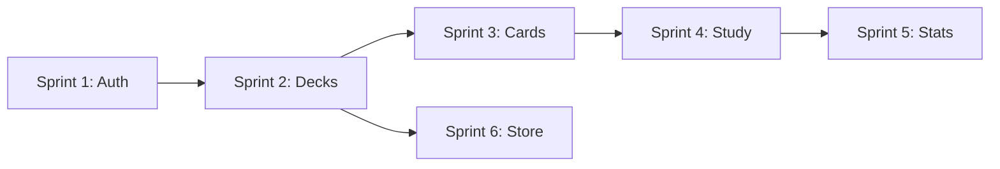
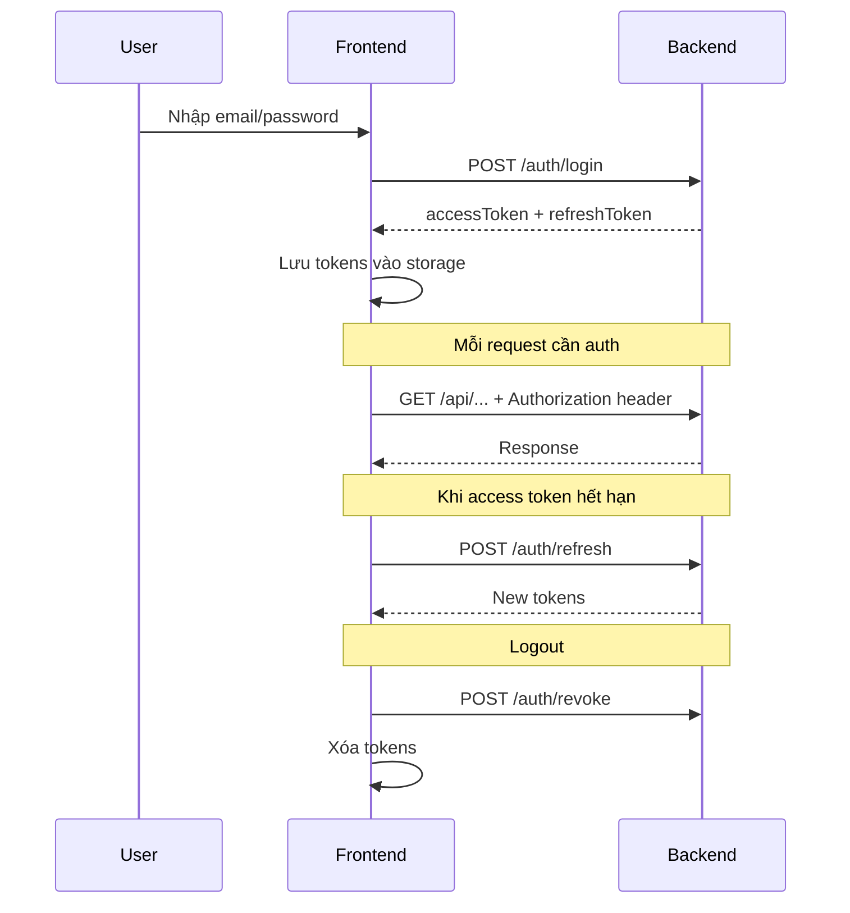

# API Documentation - LearningShare

> **Base URL**: `http://localhost:5212/api`

## Quick Start

1. **Login** để lấy access token
2. Gửi token trong header: `Authorization: Bearer <access_token>`
3. Tất cả responses có format chuẩn (xem [Response Format](#response-format))

---

## Sprint Overview

| Sprint | Chủ đề | Mô tả | File |
|--------|--------|-------|------|
| **Sprint 1** | Authentication & User | Đăng nhập, đăng ký, quản lý user, settings | [sprint-1-api.md](./sprint-1-api.md) |
| **Sprint 2** | Deck Management | Quản lý bộ thẻ (tạo, sửa, xóa, publish) | [sprint-2-api.md](./sprint-2-api.md) |
| **Sprint 3** | Card Management | Quản lý flashcard, examples, media | [sprint-3-api.md](./sprint-3-api.md) |
| **Sprint 4** | Study/SRS System | Học bài, ôn tập, cram mode | [sprint-4-api.md](./sprint-4-api.md) |
| **Sprint 5** | Statistics & Dashboard | Thống kê, heatmap, forecast | [sprint-5-api.md](./sprint-5-api.md) |
| **Sprint 6** | Community Store | Browse, clone decks từ cộng đồng | [sprint-6-api.md](./sprint-6-api.md) |

---

## Thứ tự xây dựng Frontend



### Gợi ý thứ tự implement

1. **Sprint 1** - Làm trước vì cần authentication cho tất cả các tính năng khác
2. **Sprint 2** - Deck là container chính, cần có trước khi làm Cards
3. **Sprint 3** - Cards nằm trong Decks, cần hoàn thành trước Study
4. **Sprint 4** - Tính năng học tập chính, cần Cards
5. **Sprint 5** - Thống kê có thể làm song song hoặc sau Sprint 4
6. **Sprint 6** - Store độc lập, có thể làm song song với Sprint 5

---

## Response Format

Tất cả API responses đều tuân theo format sau:

```json
{
  "code": 200,
  "success": true,
  "message": "Optional message",
  "data": { ... },
  "metaData": null
}
```

### Success Response

| Field      | Type      | Description              |
| ---------- | --------- | ------------------------ |
| `code`     | `number`  | `200` khi thành công     |
| `success`  | `boolean` | `true` nếu thành công    |
| `message`  | `string?` | Message optional         |
| `data`     | `object`  | Response data            |
| `metaData` | `object?` | Pagination info (nếu có) |

### Error Response

```json
{
  "code": 200,
  "success": false,
  "message": "Error_Code",
  "data": null,
  "metaData": null
}
```

### HTTP Status Codes

| Status | Ý nghĩa |
|--------|---------|
| `200` + `success: true` | Thành công |
| `200` + `success: false` | Business logic error (đoán được) |
| `401` | Token không hợp lệ/hết hạn |
| `404` | Resource không tồn tại |
| `500` | Lỗi server không đoán được |

---

## Authentication Flow



---

## Main User Flows

### 1. Luồng học bài mới

```
Dashboard → GET /srs/count → "8 new cards"
         ↓
Click "Learn New" → GET /srs/lessons/new?deckId=5&limit=5
                  ↓
                  POST /srs/reviews/{cardId}/submit (isCorrect: true)
                  ↓
                  Hiển thị card tiếp theo...
```

### 2. Luồng ôn tập

```
Dashboard → GET /srs/count → "15 reviews due"
         ↓
Click "Review" → POST /srs/sessions/start (mode: "review")
              ↓
              Nhận session + card đầu tiên
              ↓
              User trả lời → POST /srs/sessions/submit
              ↓
              Nhận card tiếp theo...
              ↓
              Hết cards → POST /srs/sessions/end
              ↓
              Hiển thị summary
```

### 3. Luồng tạo deck và cards

```
My Decks → Click "New Deck" → POST /decks
                            ↓
                            Nhận deckId
                            ↓
        Deck Detail → POST /decks/{deckId}/cards (tạo từng card)
                    hoặc
                    → POST /decks/{deckId}/cards/bulk (import nhiều)
```

### 4. Luồng clone deck từ Store

```
Store → GET /store/decks (browse)
     ↓
     Click deck → GET /store/decks/{id} (preview)
               ↓
               Click "Clone" → POST /store/decks/{id}/clone
                            ↓
                            Deck mới xuất hiện trong My Decks
```

---

## Data Types Quick Reference

### Card Types

| Type | Mô tả | Fields đặc biệt |
|------|-------|-----------------|
| `Vocabulary` | Từ vựng | `vocabularyDetails` (reading, partOfSpeech, pitch...) |
| `Grammar` | Ngữ pháp | `grammarDetails` (structure, explanation, level...) |

### SRS Levels

| Level | Tên | Interval |
|-------|-----|----------|
| 0 | New | Chưa học |
| 1-4 | Apprentice | 4h → 8h → 1d → 2d |
| 5-6 | Guru | 1w → 2w |
| 7 | Master | 1 month |
| 8 | Enlightened | 4 months |
| 9-12 | Burned | Đã thuộc |

### Review Types

| Type | Khi nào dùng |
|------|--------------|
| `Learn` | Học card mới lần đầu |
| `Review` | Ôn tập SRS thông thường |
| `Cram` | Luyện tập không ảnh hưởng SRS |
| `Ghost` | Ôn ghost cards (cards hay quên) |

---

## Key Entities & Relationships

```
User
 ├── UserSettings
 ├── Decks (ownership)
 │    ├── Cards
 │    │    ├── GrammarDetails (1:1, for Grammar cards)
 │    │    ├── VocabularyDetails (1:1, for Vocabulary cards)
 │    │    └── CardExamples (1:N)
 │    └── DeckTags
 ├── UserCardProgress (SRS data per card)
 └── StudyLogs (review history)
```

---

## New Features (Latest Update)

### VocabularyDetails (for Vocabulary cards)

| Field | Type | Description |
|-------|------|-------------|
| `reading` | `string?` | Cách đọc hiragana (たべる) |
| `partOfSpeech` | `string?` | Noun, Verb, い-Adj, な-Adj... |
| `pitch` | `string?` | Pitch accent pattern |
| `jlptLevel` | `string?` | N5, N4, N3, N2, N1 |
| `frequency` | `number?` | Tần suất sử dụng |
| `waniKaniLevel` | `number?` | WaniKani level |
| `transitivity` | `string?` | Transitive/Intransitive |
| `verbGroup` | `string?` | Group 1/2/3 |
| `adjectiveType` | `string?` | い-adj, な-adj |
| `commonCollocations` | `string?` | Cụm từ hay đi kèm |
| `antonyms` | `string?` | Từ trái nghĩa |
| `kanjiComponents` | `string?` | Kanji thành phần |

### Enhanced SRS Tracking

| Field | Type | Description |
|-------|------|-------------|
| `easeFactor` | `number` | SM-2 ease factor (1.3-2.5) |
| `totalReviews` | `number` | Tổng số lần review |
| `correctCount` | `number` | Số lần đúng |
| `incorrectCount` | `number` | Số lần sai |
| `lapseCount` | `number` | Số lần rớt level |
| `isLeech` | `boolean` | true nếu lapseCount >= 8 |
| `firstLearnedDate` | `string?` | Ngày học lần đầu |
| `isSuspended` | `boolean` | Card bị tạm dừng |

### Enhanced Card Fields

| Field | Type | Description |
|-------|------|-------------|
| `difficulty` | `number` | Độ khó 1-5 |
| `priority` | `number` | Thứ tự học |
| `tags` | `string?` | Tags riêng cho card |
| `isHidden` | `boolean` | Ẩn khỏi learning queue |
| `audioMediaId` | `number?` | Audio pronunciation |
| `hint` | `string?` | Gợi ý khi user bí |

### Enhanced StudyLog

| Field | Type | Description |
|-------|------|-------------|
| `responseTimeMs` | `number?` | Thời gian phản hồi |
| `oldLevel` | `number` | Level trước review |
| `newLevel` | `number` | Level sau review |
| `reviewType` | `string` | Learn/Review/Cram/Ghost |
| `userAnswer` | `string?` | Câu trả lời của user |
| `sessionId` | `string?` | Nhóm reviews theo session |

---

## Common Pagination Format

```json
{
  "data": [...],
  "metaData": {
    "page": 1,
    "pageSize": 20,
    "total": 150,
    "totalPage": 8
  }
}
```

Query parameters:
- `page` - Số trang (default: 1)
- `pageSize` - Số items mỗi trang (default: 20)

---

## Error Codes Quick Reference

| Category | Code | Meaning |
|----------|------|---------|
| Auth | `Invalid_400` | Email/password sai |
| Auth | `User_Email_409` | Email đã tồn tại |
| Auth | `Invalid_Refresh_Token_400` | Refresh token không hợp lệ |
| Deck | `Deck_Not_Found_404` | Deck không tồn tại |
| Deck | `Deck_Permission_Denied_403` | Không có quyền |
| Card | `Card_Not_Found_404` | Card không tồn tại |
| SRS | `No_Cards_Available_400` | Không có cards để học |
| Store | `Store_Already_Cloned_400` | Đã clone deck này rồi |

---

## TypeScript Interfaces (Copy-Paste Ready)

> Frontend có thể copy các interfaces này để sử dụng trực tiếp.

### API Response Wrapper

```typescript
// Wrapper chung cho tất cả API responses
interface ApiResponse<T> {
  code: number;
  success: boolean;
  message?: string;
  data: T;
  metaData?: MetaData;
}

interface MetaData {
  page: number;
  pageSize: number;
  total: number;
  totalPage: number;
}
```

### Authentication

```typescript
interface AuthDTO {
  accessToken: string;
  refreshToken: string;
  user: UserDTO;
}

interface UserDTO {
  id: number;
  username: string;
  email: string;
  role: 'Admin' | 'Learner';
  avatarUrl?: string;
}

interface LoginRequest {
  email: string;
  password: string;
}

interface RegisterRequest {
  username: string;
  email: string;
  password: string;
}
```

### Deck

```typescript
interface DeckSummaryDTO {
  id: number;
  name: string;
  description?: string;
  type: 'Vocabulary' | 'Grammar';
  author: AuthorDTO;
  stats: DeckStatsDTO;
  tags: string[];
  isPublic: boolean;
  sourceDeckId?: number;
  createdAt: string;
}

interface DeckDetailDTO {
  id: number;
  name: string;
  description?: string;
  type: 'Vocabulary' | 'Grammar';
  isPublic: boolean;
  parentDeckId?: number;
  tags: string[];
  totalCards: number;
  downloads: number;
  createdAt: string;
}

interface DeckStatsDTO {
  totalCards: number;
  downloads: number;
  learned: number;
  progress: number;
  cardsDue: number;
}

interface AuthorDTO {
  id: number;
  name: string;
  avatarUrl?: string;
}
```

### Card

```typescript
interface CardSummaryDTO {
  id: number;
  type: 'Vocabulary' | 'Grammar';
  term: string;
  meaning: string;
  imageMediaId?: number;
  imageUrl?: string;
  hasExamples: boolean;
  hasGrammarDetails: boolean;
  hasVocabularyDetails: boolean;
}

interface CardDetailDTO {
  id: number;
  deckId: number;
  type: 'Vocabulary' | 'Grammar';
  term: string;
  meaning: string;
  synonyms?: string;
  imageMediaId?: number;
  imageUrl?: string;
  note?: string;
  difficulty: number;
  priority: number;
  tags?: string;
  isHidden: boolean;
  audioMediaId?: number;
  audioUrl?: string;
  hint?: string;
  grammarDetails?: GrammarDetailsDTO;
  vocabularyDetails?: VocabularyDetailsDTO;
  examples: CardExampleDTO[];
}

interface VocabularyDetailsDTO {
  reading?: string;
  partOfSpeech?: string;
  pitch?: string;
  jlptLevel?: string;
  frequency?: number;
  waniKaniLevel?: number;
  transitivity?: string;
  verbGroup?: string;
  adjectiveType?: string;
  commonCollocations?: string;
  antonyms?: string;
  kanjiComponents?: string;
}

interface GrammarDetailsDTO {
  structure?: string;
  explanation?: string;
  caution?: string;
  level: string;
  formationRules?: string;
  nuance?: string;
  usageNotes?: string;
  register?: string;
}

interface CardExampleDTO {
  id: number;
  sentenceJapanese: string;
  sentenceMeaning: string;
  clozePart?: string;
  alternativeAnswers?: string;
  audioMediaId?: number;
  audioUrl?: string;
}
```

### Study/SRS

```typescript
interface StudyCountDTO {
  reviews: number;
  new: number;
  ghosts: number;
}

interface StudyCardDTO {
  cardId: number;
  deckId: number;
  deckName: string;
  type: 'Vocabulary' | 'Grammar';
  term: string;
  meaning: string;
  synonyms?: string;
  imageMediaId?: number;
  imageUrl?: string;
  note?: string;
  srsLevel: number;
  ghostLevel: number;
  streak: number;
  lastReviewedDate?: string;
  easeFactor: number;
  totalReviews: number;
  correctCount: number;
  incorrectCount: number;
  lapseCount: number;
  firstLearnedDate?: string;
  isSuspended: boolean;
  isLeech: boolean;
  grammarDetails?: GrammarDetailsDTO;
  vocabularyDetails?: VocabularyDetailsDTO;
  examples: CardExampleDTO[];
}

interface SessionDTO {
  sessionId: string;
  mode: 'review' | 'lesson' | 'mixed';
  totalCards: number;
  currentIndex: number;
  correct: number;
  incorrect: number;
  startedAt: string;
  currentCard?: StudyCardDTO;
  queue: number[];
}

interface CramSessionDTO {
  sessionId: string;
  type: 'All' | 'Due' | 'Failed' | 'New';
  totalCards: number;
  currentIndex: number;
  correct: number;
  incorrect: number;
  startedAt: string;
  currentCard?: StudyCardDTO;
  queue: number[];
}

interface SessionSummaryDTO {
  sessionId: string;
  totalReviewed: number;
  correct: number;
  incorrect: number;
  accuracyRate: number;
  timeSpentSeconds: number;
  startedAt: string;
  endedAt: string;
}

interface SubmitReviewRequest {
  isCorrect: boolean;
  timeSpentMs?: number;
  userAnswer?: string;
  exampleId?: number;
  sessionId?: string;
  reviewType?: 'Learn' | 'Review' | 'Cram' | 'Ghost';
}

interface SubmitReviewResponse {
  cardId: number;
  oldLevel: number;
  newLevel: number;
  nextReviewDate: string;
  ghostLevel: number;
  streak: number;
  isCorrect: boolean;
  message: string;
  easeFactor: number;
  totalReviews: number;
  correctCount: number;
  incorrectCount: number;
  lapseCount: number;
  isLeech: boolean;
}
```

### Statistics

```typescript
interface HeatmapDataDTO {
  date: string;
  count: number;
}

interface ForecastDTO {
  date: string;
  count: number;
}

interface AccuracyDTO {
  correct: number;
  incorrect: number;
  total: number;
  rate: number;
}

interface LevelDistributionDTO {
  distribution: Record<number, number>;
  totalCards: number;
  learnedCards: number;
  burnedCards: number;
}
```

---

## API Testing with cURL

### Login Example

```bash
curl -X POST "http://localhost:5212/api/auth/login" \
  -H "Content-Type: application/json" \
  -d '{"email": "user@example.com", "password": "password123"}'
```

### Authenticated Request Example

```bash
TOKEN="your_access_token_here"

curl -X GET "http://localhost:5212/api/decks" \
  -H "Authorization: Bearer $TOKEN"
```

### Create Vocabulary Card Example

```bash
curl -X POST "http://localhost:5212/api/decks/1/cards" \
  -H "Authorization: Bearer $TOKEN" \
  -H "Content-Type: application/json" \
  -d '{
    "type": "Vocabulary",
    "term": "食べる",
    "meaning": "Ăn",
    "vocabularyDetails": {
      "reading": "たべる",
      "partOfSpeech": "Verb",
      "verbGroup": "Group 2"
    },
    "examples": [{
      "sentenceJapanese": "私はりんごを食べる",
      "sentenceMeaning": "Tôi ăn táo",
      "clozePart": "食べる"
    }]
  }'
```
