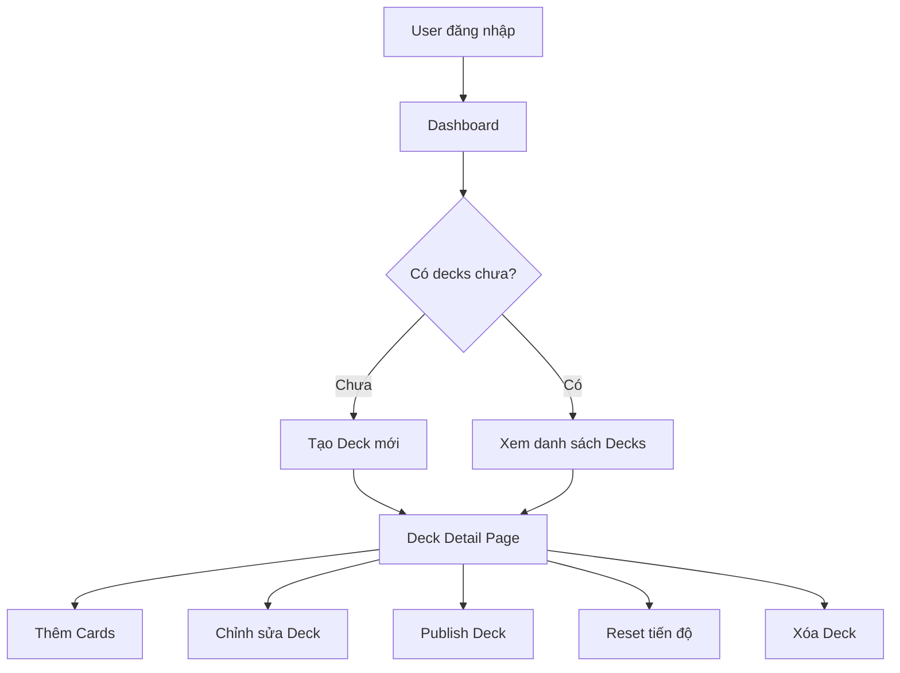

# Sprint 2: Deck Management - API Documentation

> **Base URL**: `http://localhost:5000/api`
>
> **Authentication**: Tất cả endpoints trong Sprint này đều yêu cầu 🔒 `Authorization: Bearer <access_token>`

---

## Application Flow Overview



### Luồng sử dụng chính

1. **Dashboard** → Gọi `GET /decks/statistics` để hiển thị tổng quan
2. **Trang Decks** → Gọi `GET /decks` để lấy danh sách decks với pagination
3. **Tạo Deck** → Gọi `POST /decks` để tạo deck mới
4. **Chi tiết Deck** → Gọi `GET /decks/{id}` để xem thông tin deck
5. **Chỉnh sửa Deck** → Gọi `PUT /decks/{id}` để cập nhật
6. **Xuất bản Deck** → Gọi `PATCH /decks/{id}/publish` để toggle public
7. **Reset tiến độ** → Gọi `POST /decks/{id}/reset` khi muốn học lại từ đầu
8. **Xóa Deck** → Gọi `DELETE /decks/{id}` để xóa

---

## Table of Contents

1. [Schemas](#schemas)
2. [Get My Decks](#1-get-my-decks)
3. [Get Deck Statistics](#2-get-deck-statistics)
4. [Get Deck Detail](#3-get-deck-detail)
5. [Create Deck](#4-create-deck)
6. [Update Deck](#5-update-deck)
7. [Toggle Publish](#6-toggle-publish)
8. [Reset Deck Progress](#7-reset-deck-progress)
9. [Delete Deck](#8-delete-deck)

---

## Schemas

### DeckSummaryDTO

Dùng trong danh sách decks - thông tin tóm tắt.

| Field          | Type           | Description                         |
| -------------- | -------------- | ----------------------------------- |
| `id`           | `number`       | ID của deck                         |
| `name`         | `string`       | Tên deck                            |
| `description`  | `string?`      | Mô tả deck                          |
| `type`         | `string`       | `"Vocabulary"` hoặc `"Grammar"`     |
| `author`       | `AuthorDTO`    | Thông tin tác giả                   |
| `stats`        | `DeckStatsDTO` | Thống kê deck                       |
| `tags`         | `string[]`     | Danh sách tags                      |
| `isPublic`     | `boolean`      | Deck có công khai không             |
| `sourceDeckId` | `number?`      | ID deck gốc nếu được clone từ Store |
| `createdAt`    | `string`       | Thời gian tạo (ISO 8601)            |

### AuthorDTO

| Field       | Type      | Description  |
| ----------- | --------- | ------------ |
| `id`        | `number`  | ID user      |
| `name`      | `string`  | Tên hiển thị |
| `avatarUrl` | `string?` | URL avatar   |

### DeckStatsDTO

| Field        | Type     | Description              |
| ------------ | -------- | ------------------------ |
| `totalCards` | `number` | Tổng số cards trong deck |
| `downloads`  | `number` | Số lần được clone        |
| `learned`    | `number` | Số cards đã học xong     |
| `progress`   | `number` | Tiến độ học (0-100%)     |
| `cardsDue`   | `number` | Số cards cần ôn hôm nay  |

### DeckDetailDTO

Dùng khi xem chi tiết deck - thông tin đầy đủ.

| Field          | Type       | Description                     |
| -------------- | ---------- | ------------------------------- |
| `id`           | `number`   | ID của deck                     |
| `name`         | `string`   | Tên deck                        |
| `description`  | `string?`  | Mô tả deck                      |
| `type`         | `string`   | `"Vocabulary"` hoặc `"Grammar"` |
| `isPublic`     | `boolean`  | Deck có công khai không         |
| `parentDeckId` | `number?`  | ID deck cha (nếu là sub-deck)   |
| `tags`         | `string[]` | Danh sách tags                  |
| `totalCards`   | `number`   | Tổng số cards                   |
| `downloads`    | `number`   | Số lần được clone               |
| `createdAt`    | `string`   | Thời gian tạo (ISO 8601)        |

### DeckStatisticsDTO

Dùng cho Dashboard - thống kê tổng quan tất cả decks.

| Field             | Type                      | Description             |
| ----------------- | ------------------------- | ----------------------- |
| `totalDecks`      | `number`                  | Tổng số decks           |
| `totalCards`      | `number`                  | Tổng số cards           |
| `totalLearned`    | `number`                  | Số cards đã học xong    |
| `totalDue`        | `number`                  | Số cards cần ôn hôm nay |
| `overallProgress` | `number`                  | Tiến độ chung (0-100%)  |
| `publicDecks`     | `number`                  | Số decks public         |
| `privateDecks`    | `number`                  | Số decks private        |
| `decksByType`     | `{ Vocabulary, Grammar }` | Phân loại theo type     |

---

## 1. Get My Decks

> **Khi nào dùng**: Hiển thị danh sách decks của user trên trang Decks

```
GET /decks
```

### Query Parameters

| Param      | Type      | Required | Default | Description                                |
| ---------- | --------- | -------- | ------- | ------------------------------------------ |
| `page`     | `number`  | ❌       | 1       | Số trang                                   |
| `pageSize` | `number`  | ❌       | 20      | Số items mỗi trang                         |
| `keyword`  | `string`  | ❌       | -       | Tìm kiếm theo tên deck                     |
| `type`     | `string`  | ❌       | -       | Filter: `"Vocabulary"` hoặc `"Grammar"`    |
| `isPublic` | `boolean` | ❌       | -       | Filter: `true` = public, `false` = private |

### Example Request

```
GET /decks?page=1&pageSize=10&type=Vocabulary&keyword=JLPT
```

### Response

```json
{
  "code": 200,
  "success": true,
  "data": [
    {
      "id": 1,
      "name": "JLPT N5 Vocabulary",
      "description": "Từ vựng cơ bản cho kỳ thi JLPT N5",
      "type": "Vocabulary",
      "author": {
        "id": 1,
        "name": "john_doe",
        "avatarUrl": "https://storage.example.com/avatars/1.jpg"
      },
      "stats": {
        "totalCards": 150,
        "downloads": 45,
        "learned": 80,
        "progress": 53.3,
        "cardsDue": 12
      },
      "tags": ["JLPT", "N5", "Japanese"],
      "isPublic": true,
      "sourceDeckId": null,
      "createdAt": "2024-01-15T10:30:00Z"
    }
  ],
  "metaData": {
    "page": 1,
    "pageSize": 10,
    "total": 25,
    "totalPage": 3
  }
}
```

### Notes

- Sử dụng `metaData` để hiển thị pagination
- Có thể kết hợp nhiều filters cùng lúc

---

## 2. Get Deck Statistics

> **Khi nào dùng**: Dashboard - hiển thị tổng quan về tất cả decks của user

```
GET /decks/statistics
```

### Response

```json
{
  "code": 200,
  "success": true,
  "data": {
    "totalDecks": 5,
    "totalCards": 450,
    "totalLearned": 280,
    "totalDue": 35,
    "overallProgress": 62.2,
    "publicDecks": 2,
    "privateDecks": 3,
    "decksByType": {
      "Vocabulary": 3,
      "Grammar": 2
    }
  }
}
```

### Notes

- `totalDue` dùng để hiển thị badge/notification cho user biết có bao nhiêu cards cần ôn
- `overallProgress` dùng để hiển thị progress bar tổng thể

---

## 3. Get Deck Detail

> **Khi nào dùng**: Xem chi tiết một deck, trước khi vào quản lý cards

```
GET /decks/{id}
```

### Path Parameters

| Param | Type     | Description |
| ----- | -------- | ----------- |
| `id`  | `number` | Deck ID     |

### Response

```json
{
  "code": 200,
  "success": true,
  "data": {
    "id": 1,
    "name": "JLPT N5 Vocabulary",
    "description": "Từ vựng cơ bản cho kỳ thi JLPT N5",
    "type": "Vocabulary",
    "isPublic": true,
    "parentDeckId": null,
    "tags": ["JLPT", "N5", "Japanese"],
    "totalCards": 150,
    "downloads": 45,
    "createdAt": "2024-01-15T10:30:00Z"
  }
}
```

### Errors

| Message                      | Khi nào                     |
| ---------------------------- | --------------------------- |
| `Deck_Not_Found_404`         | Deck không tồn tại          |
| `Deck_Permission_Denied_403` | Không có quyền xem deck này |

### Notes

- Khi nhận error `Deck_Not_Found_404`, redirect về trang 404
- Từ trang này có thể navigate đến trang quản lý cards

---

## 4. Create Deck

> **Khi nào dùng**: User tạo deck mới để bắt đầu thêm cards học tập

```
POST /decks
```

### Request Body

```json
{
  "name": "Kanji N3",
  "description": "Học Kanji cho JLPT N3",
  "type": "Vocabulary",
  "isPublic": false,
  "parentDeckId": null,
  "tags": ["JLPT", "N3", "Kanji"]
}
```

| Field          | Type       | Required | Description                       |
| -------------- | ---------- | -------- | --------------------------------- |
| `name`         | `string`   | ✅       | Tên deck                          |
| `description`  | `string`   | ❌       | Mô tả deck                        |
| `type`         | `string`   | ✅       | `"Vocabulary"` hoặc `"Grammar"`   |
| `isPublic`     | `boolean`  | ❌       | Công khai deck (default: `false`) |
| `parentDeckId` | `number`   | ❌       | ID deck cha (nếu là sub-deck)     |
| `tags`         | `string[]` | ❌       | Tags để phân loại                 |

### Response

Trả về `DeckDetailDTO` của deck vừa tạo.

```json
{
  "code": 200,
  "success": true,
  "data": {
    "id": 6,
    "name": "Kanji N3",
    "description": "Học Kanji cho JLPT N3",
    "type": "Vocabulary",
    "isPublic": false,
    "parentDeckId": null,
    "tags": ["JLPT", "N3", "Kanji"],
    "totalCards": 0,
    "downloads": 0,
    "createdAt": "2024-12-30T08:00:00Z"
  }
}
```

### Errors

| Message                             | Khi nào                                 |
| ----------------------------------- | --------------------------------------- |
| `Deck_Invalid_Type_400`             | Type không phải Vocabulary hoặc Grammar |
| `Deck_Parent_Not_Found_404`         | ParentDeckId không tồn tại              |
| `Deck_Parent_Permission_Denied_403` | Không có quyền tạo sub-deck             |

### Notes

- Sau khi tạo thành công, navigate đến trang deck detail để thêm cards
- Có thể hiển thị form trong modal hoặc page riêng

---

## 5. Update Deck

> **Khi nào dùng**: Chỉnh sửa thông tin deck (tên, mô tả, tags)

```
PUT /decks/{id}
```

### Path Parameters

| Param | Type     | Description |
| ----- | -------- | ----------- |
| `id`  | `number` | Deck ID     |

### Request Body

```json
{
  "name": "Kanji N3 - Updated",
  "description": "Học 300+ Kanji cho JLPT N3",
  "isPublic": true,
  "tags": ["JLPT", "N3", "Kanji", "Advanced"]
}
```

| Field         | Type       | Required | Description       |
| ------------- | ---------- | -------- | ----------------- |
| `name`        | `string`   | ✅       | Tên deck mới      |
| `description` | `string`   | ❌       | Mô tả mới         |
| `isPublic`    | `boolean`  | ✅       | Trạng thái public |
| `tags`        | `string[]` | ❌       | Tags mới          |

> [!NOTE]
> Không thể thay đổi `type` của deck sau khi tạo.

### Response

Trả về `DeckDetailDTO` đã cập nhật.

### Errors

| Message                      | Khi nào                     |
| ---------------------------- | --------------------------- |
| `Deck_Not_Found_404`         | Deck không tồn tại          |
| `Deck_Permission_Denied_403` | Không có quyền sửa deck này |

---

## 6. Toggle Publish

> **Khi nào dùng**: Xuất bản deck lên Store công cộng hoặc ẩn deck đi

```
PATCH /decks/{id}/publish
```

### Path Parameters

| Param | Type     | Description |
| ----- | -------- | ----------- |
| `id`  | `number` | Deck ID     |

### Response

Trả về `DeckDetailDTO` với `isPublic` đã toggle.

```json
{
  "code": 200,
  "success": true,
  "data": {
    "id": 1,
    "name": "JLPT N5 Vocabulary",
    "isPublic": true,
    ...
  }
}
```

### Errors

| Message                      | Khi nào                |
| ---------------------------- | ---------------------- |
| `Deck_Not_Found_404`         | Deck không tồn tại     |
| `Deck_Permission_Denied_403` | Không có quyền publish |

### Notes

- API này toggle trạng thái `isPublic`
- Nếu đang `false` sẽ chuyển thành `true` và ngược lại
- Hiển thị toast thông báo phù hợp với trạng thái mới

---

## 7. Reset Deck Progress

> **Khi nào dùng**: Xóa toàn bộ tiến độ học và bắt đầu lại từ đầu

```
POST /decks/{id}/reset
```

### Path Parameters

| Param | Type     | Description |
| ----- | -------- | ----------- |
| `id`  | `number` | Deck ID     |

### Response

```json
{
  "code": 200,
  "success": true,
  "data": true
}
```

> [!WARNING]
> Action này không thể hoàn tác! Tất cả SRS levels và lịch sử học sẽ bị xóa.

### Errors

| Message                      | Khi nào              |
| ---------------------------- | -------------------- |
| `Deck_Not_Found_404`         | Deck không tồn tại   |
| `Deck_Permission_Denied_403` | Không có quyền reset |

### Notes

- **BẮT BUỘC** hiển thị confirmation dialog trước khi gọi API
- Thông báo rõ ràng rằng action không thể hoàn tác

---

## 8. Delete Deck

> **Khi nào dùng**: Xóa vĩnh viễn deck và tất cả cards bên trong

```
DELETE /decks/{id}
```

### Path Parameters

| Param | Type     | Description |
| ----- | -------- | ----------- |
| `id`  | `number` | Deck ID     |

### Response

```json
{
  "code": 200,
  "success": true,
  "data": true
}
```

> [!CAUTION]
> Xóa deck sẽ xóa tất cả cards bên trong! Không thể hoàn tác.

### Errors

| Message                      | Khi nào                     |
| ---------------------------- | --------------------------- |
| `Deck_Not_Found_404`         | Deck không tồn tại          |
| `Deck_Permission_Denied_403` | Không có quyền xóa deck này |

### Notes

- **BẮT BUỘC** hiển thị confirmation dialog trước khi gọi API
- Hiển thị số lượng cards sẽ bị xóa trong dialog
- Sau khi xóa thành công, redirect về trang danh sách decks

---

## UI Components Checklist

- [ ] **DecksListPage** - Danh sách decks với filter & search
- [ ] **DeckCard** - Card hiển thị thông tin tóm tắt deck
- [ ] **DeckDetailPage** - Trang chi tiết deck
- [ ] **CreateDeckModal** - Modal tạo deck mới
- [ ] **EditDeckModal** - Modal chỉnh sửa deck
- [ ] **DeckStatisticsWidget** - Widget thống kê cho Dashboard
- [ ] **ConfirmDeleteModal** - Modal xác nhận xóa
- [ ] **ConfirmResetModal** - Modal xác nhận reset tiến độ

---

## Error Messages Reference

| Message                             | Description                       |
| ----------------------------------- | --------------------------------- |
| `Deck_Invalid_Type_400`             | Loại deck không hợp lệ            |
| `Deck_Parent_Not_Found_404`         | Deck cha không tồn tại            |
| `Deck_Parent_Permission_Denied_403` | Không có quyền tạo deck con       |
| `Deck_Not_Found_404`                | Deck không tồn tại                |
| `Deck_Permission_Denied_403`        | Không có quyền thao tác trên deck |
