# Sprint 4: Study/SRS System - API Documentation

> **Base URL**: `http://localhost:5000/api`
>
> **Authentication**: Tất cả endpoints trong Sprint này đều yêu cầu 🔒 `Authorization: Bearer <access_token>`

---

## Application Flow Overview

```mermaid
flowchart TD
    A[Dashboard] --> B{Có cards cần học?}
    B -->|Reviews > 0| C[Start Review Session]
    B -->|New > 0| D[Start Lesson Session]
    B -->|Muốn luyện tập| E[Start Cram Session]

    C --> F[Study Screen]
    D --> F
    E --> G[Cram Screen]

    F --> H{Đúng/Sai}
    G --> I{Đúng/Sai}

    H -->|Submit| J[Update SRS Level]
    I -->|Submit| K[Không update SRS]

    J --> L{Còn cards?}
    K --> M{Còn cards?}

    L -->|Còn| F
    L -->|Hết| N[Session Summary]
    M -->|Còn| G
    M -->|Hết| N
```



### Luồng sử dụng chính

**Study (có update SRS):**

1. **Dashboard** → Gọi `GET /srs/count` để hiển thị số cards cần học
2. **Bắt đầu học** → Gọi `POST /srs/sessions/start` để lấy session + card đầu tiên
3. **Submit kết quả** → Gọi `POST /srs/sessions/submit` để gửi kết quả + lấy card tiếp
4. **Kết thúc** → Gọi `POST /srs/sessions/end` để lấy summary

**Cram (không update SRS - để luyện tập):**

1. Gọi `POST /srs/cram/start` để bắt đầu cram session
2. Gọi `POST /srs/cram/submit` để submit và lấy card tiếp (không ảnh hưởng SRS)

---

## Table of Contents

1. [Schemas](#schemas)
2. [Study Core APIs](#study-core-apis)
3. [Session Management](#session-management)
4. [Cram Mode](#cram-mode)

---

## Schemas

### StudyCountDTO

Số lượng cards cần học - dùng cho Dashboard.

| Field     | Type     | Description                       |
| --------- | -------- | --------------------------------- |
| `reviews` | `number` | Số cards cần ôn tập (đã đến hạn)  |
| `new`     | `number` | Số cards mới chưa học             |
| `ghosts`  | `number` | Số ghost cards (cần củng cố thêm) |

### StudyCardDTO

Thông tin card trong phiên học.

| Field              | Type                    | Description                          |
| ------------------ | ----------------------- | ------------------------------------ |
| `cardId`           | `number`                | ID của card                          |
| `deckId`           | `number`                | ID deck chứa card                    |
| `deckName`         | `string`                | Tên deck                             |
| `type`             | `string`                | `"Vocabulary"` hoặc `"Grammar"`      |
| `term`             | `string`                | Từ vựng/cấu trúc                     |
| `meaning`          | `string`                | Nghĩa                                |
| `synonyms`         | `string?`               | Từ đồng nghĩa                        |
| `imageMediaId`     | `number?`               | ID ảnh                               |
| `imageUrl`         | `string?`               | URL ảnh                              |
| `note`             | `string?`               | Ghi chú                              |
| `srsLevel`         | `number`                | Level SRS hiện tại (0-12)            |
| `ghostLevel`       | `number`                | Ghost level (0-3)                    |
| `streak`           | `number`                | Số lần đúng liên tiếp                |
| `lastReviewedDate` | `string?`               | Lần review gần nhất                  |
| `easeFactor`       | `number`                | **[NEW]** SM-2 ease factor (1.3-2.5) |
| `totalReviews`     | `number`                | **[NEW]** Tổng số lần review         |
| `correctCount`     | `number`                | **[NEW]** Số lần đúng                |
| `incorrectCount`   | `number`                | **[NEW]** Số lần sai                 |
| `lapseCount`       | `number`                | **[NEW]** Số lần "lapse" (rớt level) |
| `firstLearnedDate` | `string?`               | **[NEW]** Ngày học lần đầu           |
| `isSuspended`      | `boolean`               | **[NEW]** Card có bị tạm dừng không  |
| `isLeech`          | `boolean`               | **[NEW]** Card khó nhớ (lapses >= 8) |
| `grammarDetails`   | `GrammarDetailsDTO?`    | Chi tiết ngữ pháp                    |
| `vocabularyDetails`| `VocabularyDetailsDTO?` | **[NEW]** Chi tiết từ vựng           |
| `examples`         | `CardExampleDTO[]`      | Danh sách ví dụ                      |

### SessionDTO

Thông tin phiên học.

| Field          | Type            | Description                       |
| -------------- | --------------- | --------------------------------- |
| `sessionId`    | `string`        | ID của session (UUID)             |
| `mode`         | `string`        | `"review"`, `"lesson"`, `"mixed"` |
| `totalCards`   | `number`        | Tổng số cards trong session       |
| `currentIndex` | `number`        | Index cards hiện tại (0-based)    |
| `correct`      | `number`        | Số câu đúng                       |
| `incorrect`    | `number`        | Số câu sai                        |
| `startedAt`    | `string`        | Thời gian bắt đầu                 |
| `currentCard`  | `StudyCardDTO?` | Card hiện tại để học              |
| `queue`        | `number[]`      | Danh sách cardIds còn lại         |

### SessionSummaryDTO

Tổng kết sau khi kết thúc phiên học.

| Field              | Type     | Description          |
| ------------------ | -------- | -------------------- |
| `sessionId`        | `string` | ID của session       |
| `totalReviewed`    | `number` | Tổng số cards đã học |
| `correct`          | `number` | Số câu đúng          |
| `incorrect`        | `number` | Số câu sai           |
| `accuracyRate`     | `number` | Tỷ lệ đúng (0-100%)  |
| `timeSpentSeconds` | `number` | Thời gian học (giây) |
| `startedAt`        | `string` | Thời gian bắt đầu    |
| `endedAt`          | `string` | Thời gian kết thúc   |

### SubmitReviewRequest

Request body khi submit review.

| Field         | Type      | Required | Description                           |
| ------------- | --------- | -------- | ------------------------------------- |
| `isCorrect`   | `boolean` | ✅       | Người dùng trả lời đúng/sai           |
| `timeSpentMs` | `number`  | ❌       | Thời gian suy nghĩ (ms)               |
| `userAnswer`  | `string`  | ❌       | **[NEW]** Câu trả lời của user        |
| `exampleId`   | `number`  | ❌       | **[NEW]** Example ID được sử dụng     |
| `sessionId`   | `string`  | ❌       | **[NEW]** Session ID để nhóm reviews  |
| `reviewType`  | `string`  | ❌       | **[NEW]** `"Learn"`, `"Review"`, `"Cram"`, `"Ghost"` |

### SubmitReviewResponse

Kết quả sau khi submit review.

| Field            | Type      | Description                          |
| ---------------- | --------- | ------------------------------------ |
| `cardId`         | `number`  | ID card                              |
| `oldLevel`       | `number`  | Level SRS trước đó                   |
| `newLevel`       | `number`  | Level SRS mới                        |
| `nextReviewDate` | `string`  | Ngày review tiếp theo                |
| `ghostLevel`     | `number`  | Ghost level sau khi cập nhật         |
| `streak`         | `number`  | Streak sau khi cập nhật              |
| `isCorrect`      | `boolean` | Kết quả đúng/sai                     |
| `message`        | `string`  | Thông điệp (vd: "Level up!")         |
| `easeFactor`     | `number`  | **[NEW]** Ease factor sau cập nhật   |
| `totalReviews`   | `number`  | **[NEW]** Tổng số reviews            |
| `correctCount`   | `number`  | **[NEW]** Tổng số lần đúng           |
| `incorrectCount` | `number`  | **[NEW]** Tổng số lần sai            |
| `lapseCount`     | `number`  | **[NEW]** Số lần lapse               |
| `isLeech`        | `boolean` | **[NEW]** true nếu lapseCount >= 8   |

---

## Study Core APIs

### 1. Get Study Count

> **Khi nào dùng**: Dashboard - hiển thị badge số cards cần học

```
GET /srs/count
```

#### Query Parameters

| Param    | Type     | Required | Description                      |
| -------- | -------- | -------- | -------------------------------- |
| `deckId` | `number` | ❌       | Filter theo deck (null = tất cả) |

#### Response

```json
{
  "code": 200,
  "success": true,
  "data": {
    "reviews": 15,
    "new": 8,
    "ghosts": 3
  }
}
```

### Notes

- `reviews` > 0: Hiển thị badge màu đỏ/cam, ưu tiên ôn tập
- `ghosts` > 0: Cards hay quên, cần củng cố thêm
- `new`: Cards chưa học bao giờ

---

### 2. Get Available Reviews

> **Khi nào dùng**: Lấy danh sách cards cần ôn tập

```
GET /srs/reviews/available
```

#### Query Parameters

| Param    | Type     | Required | Default | Description      |
| -------- | -------- | -------- | ------- | ---------------- |
| `deckId` | `number` | ❌       | null    | Filter theo deck |
| `limit`  | `number` | ❌       | 20      | Số cards tối đa  |

#### Response

```json
{
  "code": 200,
  "success": true,
  "data": [
    {
      "cardId": 1,
      "deckId": 5,
      "deckName": "JLPT N5",
      "type": "Vocabulary",
      "term": "食べる",
      "meaning": "Ăn",
      "srsLevel": 3,
      "ghostLevel": 0,
      "streak": 2,
      "easeFactor": 2.5,
      "totalReviews": 5,
      "correctCount": 4,
      "incorrectCount": 1,
      "lapseCount": 0,
      "isLeech": false,
      "vocabularyDetails": {
        "reading": "たべる",
        "partOfSpeech": "Verb",
        "verbGroup": "Group 2"
      },
      "examples": [...]
    }
  ]
}
```

### Notes

- Ghost cards được ưu tiên trả về trước
- Cards được sắp xếp theo mức độ cần ôn
- **[NEW]** Response bao gồm `vocabularyDetails` cho Vocabulary cards

---

### 3. Get New Lessons

> **Khi nào dùng**: Lấy cards mới chưa học trong một deck

```
GET /srs/lessons/new
```

#### Query Parameters

| Param    | Type     | Required | Default | Description     |
| -------- | -------- | -------- | ------- | --------------- |
| `deckId` | `number` | ✅       | -       | ID deck         |
| `limit`  | `number` | ❌       | 5       | Số cards tối đa |

#### Response

Trả về array `StudyCardDTO[]`

---

### 4. Submit Review (Standalone)

> **Khi nào dùng**: Submit kết quả review đơn lẻ (không qua session)

```
POST /srs/reviews/{cardId}/submit
```

#### Path Parameters

| Param    | Type     | Description |
| -------- | -------- | ----------- |
| `cardId` | `number` | Card ID     |

#### Request Body

```json
{
  "isCorrect": true,
  "timeSpentMs": 3500,
  "userAnswer": "食べる",
  "reviewType": "Review",
  "sessionId": "550e8400-e29b-41d4-a716-446655440000"
}
```

| Field         | Type      | Required | Description                                          |
| ------------- | --------- | -------- | ---------------------------------------------------- |
| `isCorrect`   | `boolean` | ✅       | Người dùng trả lời đúng/sai                          |
| `timeSpentMs` | `number`  | ❌       | Thời gian suy nghĩ (ms)                              |
| `userAnswer`  | `string`  | ❌       | **[NEW]** Câu trả lời của user                       |
| `exampleId`   | `number`  | ❌       | **[NEW]** Example được dùng trong quiz               |
| `sessionId`   | `string`  | ❌       | **[NEW]** Session ID để nhóm các reviews             |
| `reviewType`  | `string`  | ❌       | **[NEW]** Loại review: `Learn`, `Review`, `Cram`, `Ghost` |

#### Response

```json
{
  "code": 200,
  "success": true,
  "data": {
    "cardId": 1,
    "oldLevel": 3,
    "newLevel": 4,
    "nextReviewDate": "2025-01-02T10:00:00Z",
    "ghostLevel": 0,
    "streak": 3,
    "isCorrect": true,
    "message": "Good job! Level up to 4",
    "easeFactor": 2.5,
    "totalReviews": 6,
    "correctCount": 5,
    "incorrectCount": 1,
    "lapseCount": 0,
    "isLeech": false
  }
}
```

### SRS Level Progression

| Level | Interval | Mô tả                   |
| ----- | -------- | ----------------------- |
| 0     | Mới      | Chưa học                |
| 1     | 4 giờ    | Apprentice 1            |
| 2     | 8 giờ    | Apprentice 2            |
| 3     | 1 ngày   | Apprentice 3            |
| 4     | 2 ngày   | Apprentice 4            |
| 5     | 1 tuần   | Guru 1                  |
| 6     | 2 tuần   | Guru 2                  |
| 7     | 1 tháng  | Master                  |
| 8     | 4 tháng  | Enlightened             |
| 9-12  | Burned   | Đã thuộc (không ôn nữa) |

### Ease Factor Algorithm (SM-2)

> **[NEW]** Hệ thống SRS sử dụng thuật toán SM-2 để điều chỉnh độ khó của mỗi card.

- **Đúng**: `easeFactor += 0.1` (tối đa 2.5)
- **Sai**: `easeFactor -= 0.2` (tối thiểu 1.3)
- **Leech Detection**: Nếu `lapseCount >= 8`, card được đánh dấu là "leech" - cần xem xét lại

---

## Session Management

### 5. Start Session

> **Khi nào dùng**: Bắt đầu phiên học tập mới

```
POST /srs/sessions/start
```

#### Request Body

```json
{
  "deckId": 5,
  "mode": "review",
  "limit": 10
}
```

| Field    | Type     | Required | Default    | Description                            |
| -------- | -------- | -------- | ---------- | -------------------------------------- |
| `deckId` | `number` | ❌       | null       | Deck cụ thể (null = tất cả decks)      |
| `mode`   | `string` | ❌       | `"review"` | `"review"`, `"lesson"`, hoặc `"mixed"` |
| `limit`  | `number` | ❌       | 10         | Số cards tối đa                        |

**Mode giải thích:**

- `review`: Chỉ lấy cards cần ôn tập (đã đến hạn)
- `lesson`: Chỉ lấy cards mới chưa học
- `mixed`: Kết hợp cả hai

#### Response

```json
{
  "code": 200,
  "success": true,
  "data": {
    "sessionId": "550e8400-e29b-41d4-a716-446655440000",
    "mode": "review",
    "totalCards": 10,
    "currentIndex": 0,
    "correct": 0,
    "incorrect": 0,
    "startedAt": "2024-12-30T10:00:00Z",
    "currentCard": { ... },
    "queue": [2, 5, 8, 11, 15, 22, 33, 41, 55]
  }
}
```

### Notes

- Lưu `sessionId` để gửi theo mỗi lần submit
- `currentCard` là card đầu tiên để học
- `queue` chứa các cardIds còn lại (client quản lý)

---

### 6. Submit Session Answer

> **Khi nào dùng**: Submit kết quả và lấy card tiếp theo trong session

```
POST /srs/sessions/submit
```

#### Request Body

```json
{
  "sessionId": "550e8400-e29b-41d4-a716-446655440000",
  "cardId": 1,
  "isCorrect": true,
  "correct": 1,
  "incorrect": 0,
  "remainingQueue": [5, 8, 11, 15, 22, 33, 41, 55],
  "startedAt": "2024-12-30T10:00:00Z"
}
```

| Field            | Type       | Required | Description               |
| ---------------- | ---------- | -------- | ------------------------- |
| `sessionId`      | `string`   | ✅       | ID session                |
| `cardId`         | `number`   | ✅       | Card vừa submit           |
| `isCorrect`      | `boolean`  | ✅       | Đúng/sai                  |
| `correct`        | `number`   | ✅       | Tổng số đúng hiện tại     |
| `incorrect`      | `number`   | ✅       | Tổng số sai hiện tại      |
| `remainingQueue` | `number[]` | ✅       | Cards còn lại trong queue |
| `startedAt`      | `string`   | ✅       | Thời gian bắt đầu session |

#### Response

Trả về `SessionDTO` với `currentCard` là card tiếp theo.

```json
{
  "code": 200,
  "success": true,
  "data": {
    "sessionId": "550e8400-e29b-41d4-a716-446655440000",
    "mode": "review",
    "totalCards": 10,
    "currentIndex": 1,
    "correct": 1,
    "incorrect": 0,
    "startedAt": "2024-12-30T10:00:00Z",
    "currentCard": { ... },
    "queue": [8, 11, 15, 22, 33, 41, 55]
  }
}
```

### Notes

- Mỗi lần submit, SRS level của card sẽ được cập nhật
- Nếu `remainingQueue` rỗng, `currentCard` sẽ là `null` (hết cards)

---

### 7. End Session

> **Khi nào dùng**: Kết thúc phiên học và lấy summary

```
POST /srs/sessions/end
```

#### Request Body

```json
{
  "sessionId": "550e8400-e29b-41d4-a716-446655440000",
  "correct": 8,
  "incorrect": 2,
  "startedAt": "2024-12-30T10:00:00Z"
}
```

#### Response

```json
{
  "code": 200,
  "success": true,
  "data": {
    "sessionId": "550e8400-e29b-41d4-a716-446655440000",
    "totalReviewed": 10,
    "correct": 8,
    "incorrect": 2,
    "accuracyRate": 80.0,
    "timeSpentSeconds": 180,
    "startedAt": "2024-12-30T10:00:00Z",
    "endedAt": "2024-12-30T10:03:00Z"
  }
}
```

### Notes

- Hiển thị màn hình Summary với thống kê
- Có thể lưu lịch sử để hiển thị trong Statistics (Sprint 5)

---

## Cram Mode

> **Cram Mode** là chế độ luyện tập không ảnh hưởng đến SRS schedule. User có thể luyện bất kỳ cards nào mà không lo làm thay đổi tiến độ học chính.

### 8. Start Cram Session

> **Khi nào dùng**: Bắt đầu phiên luyện tập (không ảnh hưởng SRS)

```
POST /srs/cram/start
```

#### Request Body

```json
{
  "deckId": 1,
  "mode": "All",
  "limit": 20
}
```

| Field    | Type     | Required | Default | Description                           |
| -------- | -------- | -------- | ------- | ------------------------------------- |
| `deckId` | `number` | ✅       | -       | Deck muốn luyện                       |
| `mode`   | `string` | ❌       | `"All"` | `"All"`, `"Due"`, `"Failed"`, `"New"` |
| `limit`  | `number` | ❌       | 20      | Số cards tối đa                       |

**Mode giải thích:**

- `All`: Tất cả cards trong deck (đã học)
- `Due`: Chỉ cards đến hạn review
- `Failed`: Cards đã sai trong session gần nhất
- `New`: Cards chưa học

#### Response

```json
{
  "code": 200,
  "success": true,
  "data": {
    "sessionId": "660e8400-e29b-41d4-a716-446655440000",
    "type": "all",
    "totalCards": 20,
    "currentIndex": 0,
    "correct": 0,
    "incorrect": 0,
    "startedAt": "2024-12-30T14:00:00Z",
    "currentCard": { ... },
    "queue": [...]
  }
}
```

---

### 9. Submit Cram Answer

> **Khi nào dùng**: Submit kết quả trong cram mode (không update SRS)

```
POST /srs/cram/submit
```

#### Request Body

```json
{
  "sessionId": "660e8400-e29b-41d4-a716-446655440000",
  "cardId": 1,
  "isCorrect": false
}
```

#### Response

Trả về session state với card tiếp theo.

### Notes

- **QUAN TRỌNG**: Cram mode KHÔNG update SRS level
- Dùng để user luyện tập thêm mà không ảnh hưởng tiến độ
- Có thể cho phép user tự đánh dấu khi muốn "learn" một card failed

---

## UI Components Checklist

- [ ] **StudyCountWidget** - Hiển thị số reviews/new/ghosts trên Dashboard
- [ ] **StudyScreen** - Màn hình học chính (hiển thị card, nút Đúng/Sai)
- [ ] **CardFlip** - Component lật card (term ↔ meaning)
- [ ] **AnswerButtons** - Nút Correct/Incorrect
- [ ] **ProgressBar** - Tiến trình trong session
- [ ] **SessionSummary** - Màn hình tổng kết sau khi học xong
- [ ] **CramModeSelector** - Chọn mode và decks cho Cram
- [ ] **SRSLevelBadge** - Hiển thị level SRS của card
- [ ] **LeechIndicator** - **[NEW]** Hiển thị warning cho leech cards
- [ ] **EaseFactorDisplay** - **[NEW]** Hiển thị ease factor (optional)

---

## Error Messages Reference

| Message                   | Description                  |
| ------------------------- | ---------------------------- |
| `Session_Not_Found_404`   | Session không tồn tại        |
| `Session_Expired_400`     | Session đã hết hạn           |
| `Card_Not_In_Session_400` | Card không thuộc session này |
| `No_Cards_Available_400`  | Không có cards để học        |
